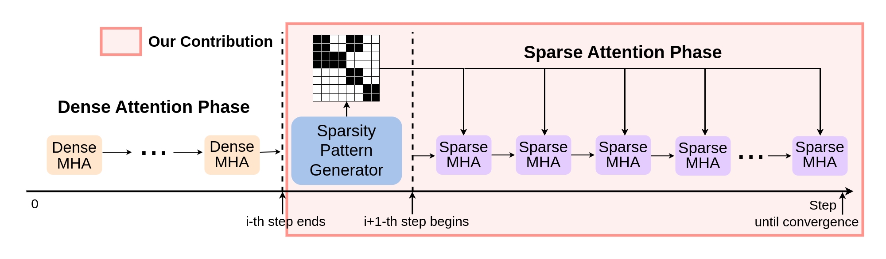
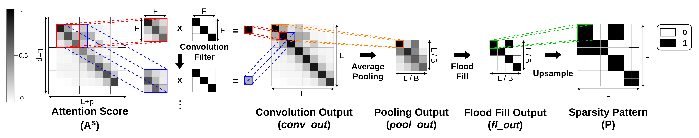

# SPION

This repository is for SPION model by [@Bokyeong1001](https://github.com/Bokyeong1001), proposed in the following paper:

> [Bokyeong Yoon](https://sites.google.com/view/bkyoon), Yoonsang Han and [Gordon Moon](https://gordonmoon.github.io/). SPION: Layer-Wise Sparse Training of Transformer via Convolutional Flood Filling. [Paper in arXiv](https://arxiv.org/abs/2309.12578). 

## Introduction

Sparsifying the Transformer has garnered considerable interest, as training the Transformer is very computationally demanding. Prior efforts to sparsify the Transformer have either used a fixed pattern or data-driven approach to reduce the number of operations involving the computation of multi-head attention, which is the main bottleneck of the Transformer. However, existing methods suffer from inevitable problems, such as the potential loss of essential sequence features due to the uniform fixed pattern applied across all layers, and an increase in the model size resulting from the use of additional parameters to learn sparsity patterns in attention operations. In this paper, we propose a novel sparsification scheme for the Transformer that integrates convolution filters and the flood filling method to efficiently capture the layer-wise sparse pattern in attention operations. Our sparsification approach reduces the computational complexity and memory footprint of the Transformer during training. Efficient implementations of the layer-wise sparsified attention algorithm on GPUs are developed, demonstrating a new SPION that achieves up to 3.08X speedup over existing state-of-the-art sparse Transformer models, with better evaluation quality. 



## Requirements
* python 3.8+
* Pytorch 1.13.1+cu117+
* CUDA 11.7.1+
* numpy 1.24.3+

## Data Preparation 

Prepare data referring to [here](https://github.com/pkuzengqi/Skyformer)

## Usage

### 1. Compile CUDA Modules for Attention and Sparse Attention Operations

```
sh compile.sh
```

### 2. Train

* SPION-CF

```
python main_conv_ff.py --mode train --task lra-image --random 1001 --name conv_ff
```

* SPION-C
```
python main_conv.py --mode train --task lra-image --random 1001 --name conv
```

* SPION-F
```
python main_ff.py --mode train --task lra-image --random 1001 --name ff
```

### 3. Inference

```
python main_inference.py --mode eval --task lra-image --random 1001 --name conv_ff
```